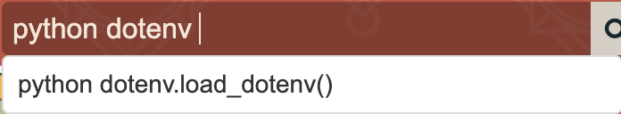

# Text-Recommend

A Chrome extension that provides intelligent next word and sentence recommendations while typing.

## ✨ Features
- Real-time text suggestions
- Context-aware recommendations
- Powered by Ollama LLM
- Works across all text input fields
- Privacy-focused: processes text locally

## ⚙️ Configuration
you can change the config in .env to change LLM model and ollama api url
```
model="llama3.2:3b"
ollama_url="http://localhost:11434"
```

## 🚀 Installation

1. Clone the repository:
```bash
git clone https://github.com/yourusername/text-recommend.git
conda create -n text-recommend python=3.12
conda activate text-recommend
pip install -r requirements.txt
```

2. Open your ollama service
```bash
ollama serve
```
or if your can't via api you can try this 
```bash
OLLAMA_ORIGINS=chrome-extension://* ollama serve
```

3. Open fastapi service
```bash
python -m uvicorn --app-dir local_api app:app --reload --port 8080
```

4. add extension as develop mode in to chrome or the browser using Chromium 

# 💡 Usage
Press ⌘ + I (Mac) or Ctrl + I (Windows) in any text input(here using llama3.2:3b)


Select suggestions using arrow keys


click bar to apply suggestion
click other area to cancel 

# 🤝 Contributing
PRs welcome! 

# TODO
- [ ] using self rag or crag to improve the recommend word

